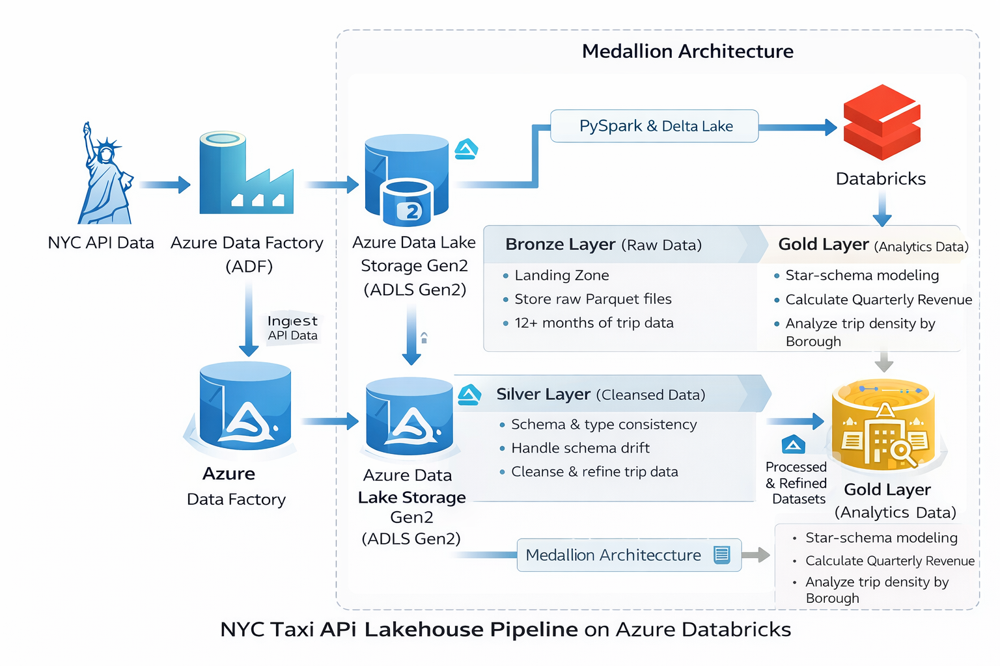

# 🚕 End-to-End Data Lakehouse Pipeline on Azure Databricks  
## NYC Taxi Analytics (Medallion Architecture)

## 📌 Overview
This project implements an **end-to-end Data Lakehouse pipeline** on **Azure Databricks** using the **NYC Taxi & Limousine Commission (TLC) Trip Record Data**. The pipeline ingests raw trip data via **Azure Data Factory (API-based ingestion)**, stores it in **Azure Data Lake Storage Gen2**, and processes it using **Apache Spark (PySpark)** and **Delta Lake** to produce analytics-ready datasets.

The solution follows a **Medallion Architecture (Bronze → Silver → Gold)** and is designed to handle **schema drift, large-scale historical data, and analytical performance optimization**.

---

## 🏗️ Architecture
**Technology Stack**
- Azure Data Factory (API-based ingestion)
- Azure Data Lake Storage Gen2
- Azure Databricks
- Apache Spark (PySpark)
- Delta Lake

**High-Level Flow**
1. Azure Data Factory ingests NYC Taxi trip data via public APIs
2. Raw data lands in ADLS Gen2 (Bronze layer)
3. Databricks processes data into Silver and Gold layers
4. Gold layer provides analytics-ready datasets for BI consumption

---

## 🧱 Medallion Architecture

### 🔹 Bronze Layer
- Stores raw Parquet files ingested from APIs
- Contains 12+ months of historical taxi trip data
- Minimal transformation applied

### 🔹 Silver Layer
- Enforces schema and correct data types
- Handles schema drift across monthly datasets
- Cleanses and standardizes trip data
- Aligns records with external lookup dimensions

### 🔹 Gold Layer
- Analytics-ready datasets
- Star-schema-based fact and dimension tables
- Optimized for reporting and analytical queries

---

## 🔑 Key Highlights
- **Architecture**: Implemented a full **Medallion Architecture (Bronze → Silver → Gold)**
- **Data Handling**: Managed **schema drift and data type enforcement** across 12+ months of Parquet files
- **Transformation**: Built a **Star Schema** by integrating external lookup dimensions (Taxi Zones, Payment Types)
- **Optimization**: Improved query performance using **Delta Lake** features and partitioned storage
- **Business Logic**:
  - Quarterly revenue calculations
  - Trip density analysis by borough
  - Aggregated KPIs for urban mobility insights

---

## 🏗️ Architecture Diagram

---

## 📊 Data Model (Star Schema)

**Fact Table**
- Taxi Trips (fare amount, trip distance, passenger count, timestamps)

**Dimension Tables**
- Taxi Zones
- Payment Types
- Date Dimension

This model supports efficient analytical queries and BI reporting.

---
